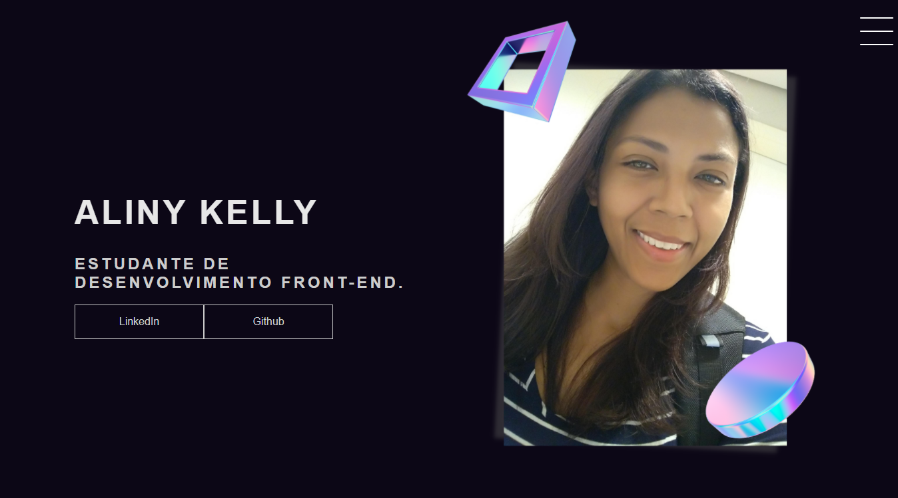

  

<h4 align="center">
  Portfólio criado com o intuito de mostrar meus projetos ao decorrer da minha carreira.
</h4>

<h4 align="center"> 
	🚧  Portfólio 🚀 Em construção...  🚧
</h4>

<h4 align="center"><a href="https://alinykelly.github.io/meuportfolio/">Clique para visitar o projeto</a></h4>

## 📚 Seções
O site é composto por 5 seções diferentes:

- **Home:** Nele temos uma breve apresentação;
- **Sobre:** Nessa seção tenho uma descrição dizendo um pouco sobre quem sou;
- **Projetos:** Apresenta alguns projetos desenvolvidos e com link direto para os respectivos códigos no GitHub;
- **Serviços:** Exibe através de cards os diferentes serviços em que possuo conhecimentos;
- **Conhecimentos:** Nele apresentamos meus conhecimentos em algumas linguagens com o foco no front-end;

---

## 💼 Tecnologias utilizadas
Para o desenvolvimento deste site utilizei as seguintes tecnologias:

- HTML;
- CSS.

---

## 🗺 Roadmap

- [x] Página HOME - Concluído: 28/02/2022
- [ ] Criação dos links para o Menu Hambúrguer - Concluído: Em breve
- [ ] Implementar Responsividade - Desafio proposto pela Gabriela - Concluído: Em breve
- [ ] Desenvolvimento da seção Serviços - Concluído: Em breve

---

## 📚 Como eu aprendi
O site foi desenvolvido através da aula PORTFOLIO RÁPIDO E FÁCIL (CRIANDO PORTFOLIO DO ZERO COM HTML E CSS)

Ministrado pela Gabriela Pinheiro e você pode conferir no canal dela.

  
 
Com o conhecimento adquirido na aula, novas implementações seram feitas em breve.

---

## 💜 Outras informações
Este portfólio foi desenvolvido para a disciplina de Desenvolvimento Web, do curso do Análise e Desenvolvimento de Sistemas.

---

## 🐱 Autora 

<a href="https://github.com/alinykelly">
 
  
 <b>Aliny Kelly</b></a> <a href="https://github.com/alinykelly" title="GitHub Aliny Kelly">🚀</a>

Feito com ❤️ por Aliny Kelly 👋🏽 Entre em contato!

  
